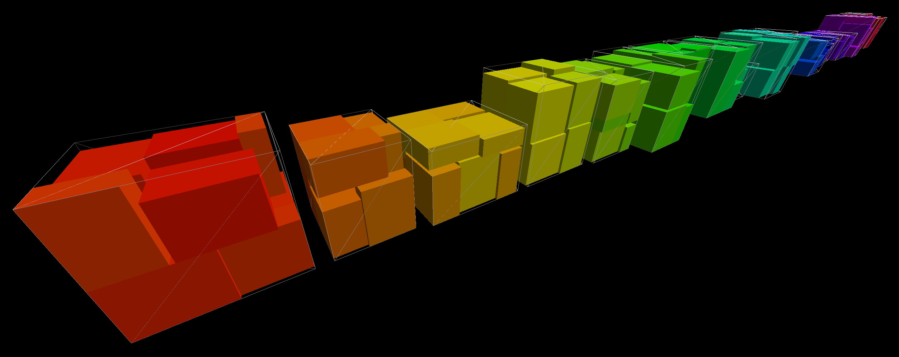

# SardineCan app

This app wraps the [SardineCan](https://github.com/merschformann/sardine-can)
3D packing solver for pushing to Nextmv platform.

Preview of such a packing:



## Pre-requisites

- [.NET 8.0 SDK](https://dotnet.microsoft.com/download/dotnet/8.0) (local runs only)
- [Docker](https://docs.docker.com/get-docker/) (for building and pushing to Nextmv)
- [Nextmv CLI](https://docs.nextmv.io/docs/platform/installation)

## Make local runs

The following commands will build a version of the app that can be run locally.
Make sure to replace the OS and arch with the appropriate values for your
system. The `--self-contained` flag will include the .NET runtime in the
published app.

First, build the app:

```bash
export OS=linux
export ARCH=x64
cd sardine-can/SC.CLI
dotnet publish --os $OS --arch $ARCH --self-contained
cp -v bin/Debug/net7.0/$OS-$ARCH/publish/SC.CLI ../../sardinecan
```

Then, run the app:

```bash
cat input.json | ./sardinecan
```

Get the help message:

```bash
./sardinecan --help
```

## Push to Nextmv

First, push the app:

```bash
nextmv app push -a <app-name>
```

Then, run the app:

```bash
nextmv app run -a <app-name> -i input.json -w > output.json
```

This will write the output to `output.json`.

## Visualize the output

It is possible to visualize the output in a standalone html file (see screenshot
above) using the [rendercube](https://github.com/merschformann/rendercube) tool.

The tool is currently only available as source code. But if Go is installed, it
can be installed with the following command:

```bash
go install github.com/merschformann/rendercube@latest
```

The output can simply be visualized by running the following command:

```bash
rendercube -input output.json -output output.html
```

If the output is wrapped in the output key (like in the `nextmv app run` example
above), we can use `jq` to unwrap it:

```bash
jq '.output' output.json | rendercube -output output.html
```

The `output.html` can then be opened in a web browser.
